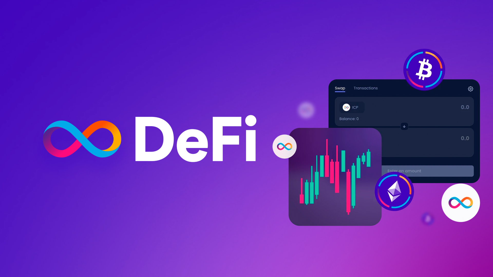
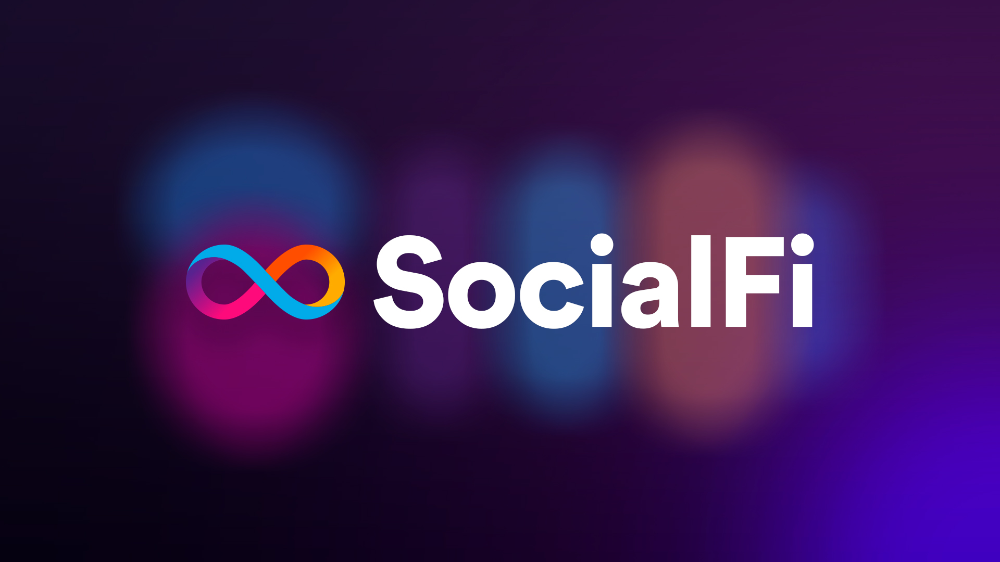
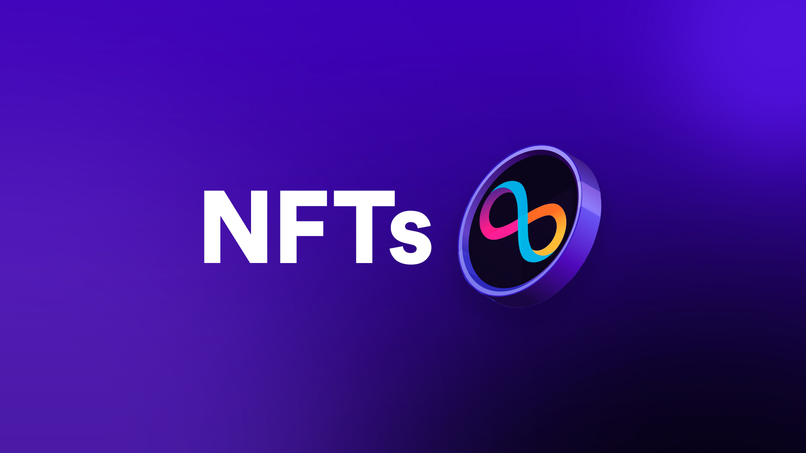
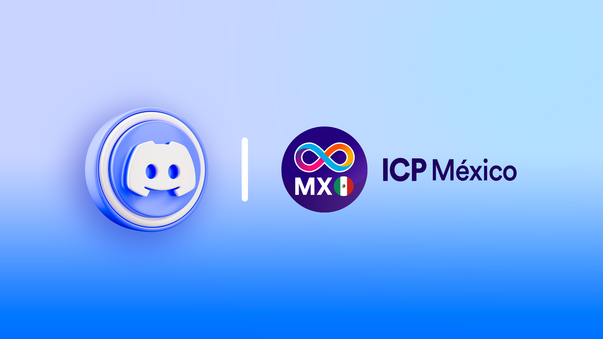
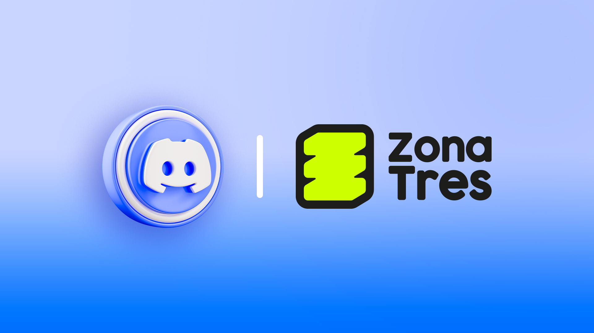
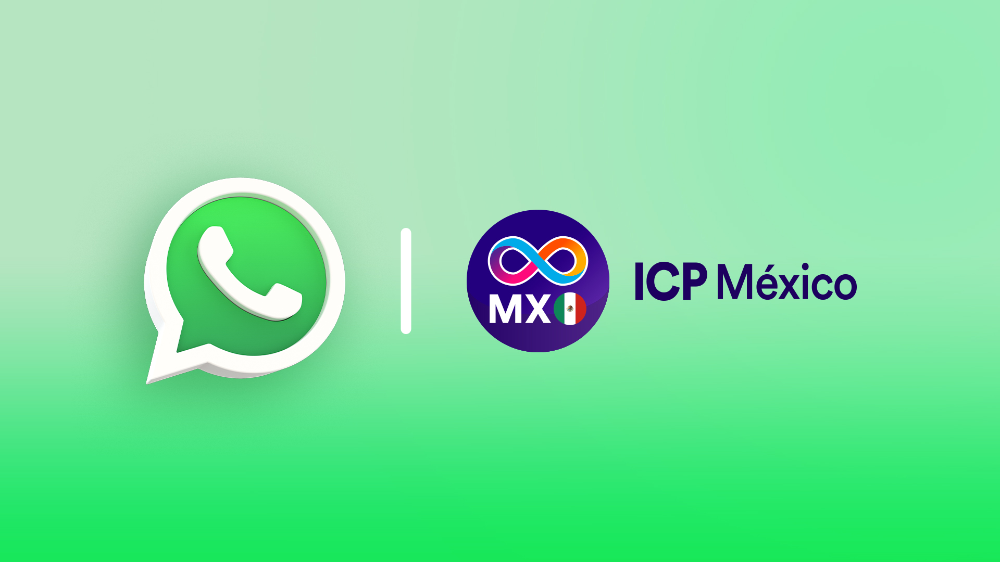

<figure><figcaption></figcaption></figure>

# 👋 ¡Bienvenid@! 

¡Bienvenidos al programa ICP Developer! Prepárate para dos semanas intensivas de aprendizaje y desarrollo, donde dominarás la creación de Canisters con Motoko. Esta certificación no solo te brindará habilidades técnicas valiosas, sino que también te conectará con una comunidad apasionada de desarrolladores.

<figure><figcaption></figcaption></figure>

### ¿Qué tengo que hacer para lograr mi certificación?

1. #### **Asiste**

   Participa activamente en las sesiones de aprendizaje en vivo a través de Zoom durante la primera semana. Estas sesiones son fundamentales para comprender los conceptos clave y resolver tus dudas.

2. #### **Desarrolla**

   Crea un Canister innovador utilizando el CDK de Motoko. Asegúrate de que tu proyecto esté alojado en un repositorio público de GitHub y cuente con una documentación clara.

3. #### **Presenta**

   Comparte tu creación con la comunidad y tu instructor a través de un repositorio público documentado y un video de 5 minutos.

  ℹ️ Puedes usar herramientas gratuitas como <a href="https://www.loom.com" target="_blank">Loom</a> para grabar y hostear tu video.

<figure><figcaption></figcaption></figure>

### ¿Qué proyectos puedo desarrollar?

Durante esta certificación, te sumergirás en el ecosistema blockchain de Internet Computer. Tu misión será crear un Canister innovador, utilizando las siguientes verticales como inspiración. Recuerda que no esperamos productos finales complejos, sino proyectos básicos que demuestren tu dominio de los conceptos aprendidos. ¡Deja volar tu creatividad!

* ## **DeFi (Finanzas Descentralizadas)**

  Construye el futuro de las finanzas con servicios descentralizados que democratizan el acceso al capital y empoderan a los usuarios. Desde intercambios descentralizados hasta plataformas de préstamos y seguros, explora cómo Internet Computer puede transformar el panorama financiero tradicional.

🔗 [Más información](https://internetcomputer.org/defi?source=nav)  

---

* ## **SocialFi**

  Revoluciona la forma en que nos conectamos en línea. Crea experiencias sociales inmersivas y descentralizadas, donde los usuarios tengan el control total de sus datos y comunidades. Desarrolla plataformas de redes sociales, foros o herramientas de comunicación que aprovechen la seguridad y escalabilidad de Internet Computer.

🔗 [Más información](https://internetcomputer.org/social-media-dapps?source=nav)  

---

* ## **NFTs**

  Da vida a activos digitales únicos y coleccionables. Crea NFTs que representen arte digital, música, objetos de juego o cualquier otra forma de propiedad digital. Utiliza Internet Computer para garantizar la autenticidad, trazabilidad y permanencia de tus NFTs e incluso para almacenar activos directamente en cadena.

🔗 [Más información](https://internetcomputer.org/nft?source=nav)  

---

* ## **Blue Sky**

  Libera tu imaginación y crea algo completamente nuevo. ¿Tienes una idea innovadora que no encaja en ninguna de las categorías anteriores? ¡Perfecto! Internet Computer te ofrece la flexibilidad y el poder para construir cualquier cosa que puedas imaginar. Desde herramientas de productividad descentralizadas hasta juegos innovadores, el cielo es el límite.

<figure><figcaption></figcaption></figure>

## Comunicación y sesiones

¡Únete a nuestra comunidad! Toda la comunicación asíncrona, anuncios y debates se llevarán a cabo en nuestros servidores de Discord. Es fundamental que te unas para no perderte ninguna actualización importante.

| **Discord ICP Hub México** | **Discord Zona Tres** | **WhatsApp ICP Hub México** |
|----------------------------|------------------------|------------------------------|
| [Canal ICP-HUB México](https://discord.gg/6TQ49NX5F2) | [Canal Zona Tres](https://discord.gg/aUUCHa96Ja) | [Grupo de WhatsApp](https://chat.whatsapp.com/FdqtZvYyujJ70qKlod6qA0) |
|  |  |  |

<figure><figcaption></figcaption></figure>

Todas las sesiones de aprendizaje se realizarán a las 1:00 PM CST (hora de la Ciudad de México). ¡No te las pierdas!

  ℹ️ Puedes hacer la conversión de zona horaria <a href="https://www.worldtimebuddy.com/?pl=1\&lid=3530597,3435910,3646738,3117735\&h=3530597\&hf=1" target="_blank">acá</a> 

 

<table><thead><tr><th>Sesión</th><th>Fecha</th><th data-type="content-ref">Link</th></tr></thead><tbody><tr><td>Aprendizaje</td><td>10 al 14 de Marzo</td><td><a href="https://us06web.zoom.us/j/84479029016?pwd=Q1o0SFhaWmxpQ0czMGxnSkJrS2NCUT09">Enlace de Zoom </a></td></tr><tr><td>Office Hours</td><td>17 y 19 de Marzo</td><td><a href="https://discord.com/channels/855182002981830656/1105937337634005135">Canal de Discord: Office Hours</a></td></tr><tr><td>Entrega de Proyecto</td><td>23 de Marzo</td><td><a href="https://forms.gle/Tc8tC1rr9Wkv8Sgc6">Forms Google</a></td></tr></tbody></table>

<figure><figcaption></figcaption></figure>
