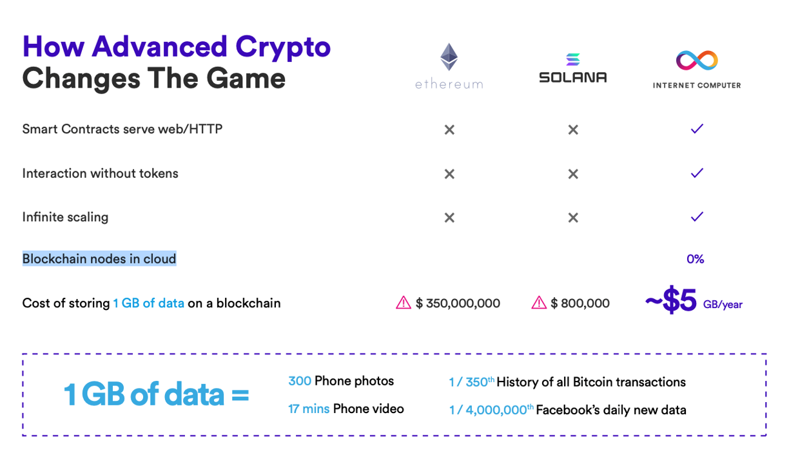
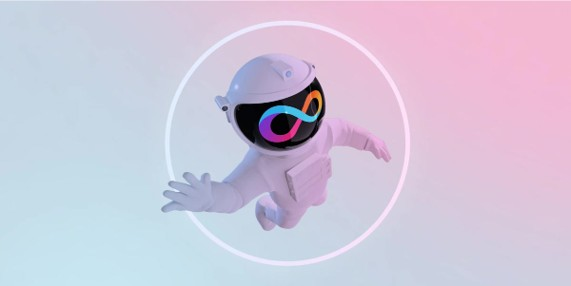

<!-- ---
description: Identifica las características que hacen único al Internet Computer Protocol.
icon: book-open
--- -->

# 📖 Lunes: Conociendo Internet Computer y Motoko 📖
Identifica las características que hacen único al Internet Computer Protocol.

<figure><figcaption></figcaption></figure>

Prepárate para una inmersión completa en el ecosistema, donde explorarás los fundamentos de Web3 y descubrirás cómo ICP está revolucionando la forma en que construimos aplicaciones.

  ℹ️ Al finalizar la sesión, lograrás:  
  <ul>
    <li> Comprender los conceptos esenciales de Web3 y su impacto en el desarrollo. </li>
    <li> Diferenciar claramente entre el desarrollo de aplicaciones Web2 y Web3. </li>
    <li> Familiarizarte con los principios básicos de la tecnología blockchain y su aplicación en ICP. </li>
    <li> Interactuar directamente con la blockchain de Internet Computer, dando tus primeros pasos como usuario Web3. </li> 
  </ul>
  </a>

<figure><figcaption></figcaption></figure>

## Desarrollo en la Era Blockchain: Web3 e Internet Computer Protocol

Web3 redefine Internet a través de la descentralización. Para los desarrolladores, esto significa construir aplicaciones y almacenar datos en una red global de nodos, en lugar de depender de servidores centralizados. En este nuevo paradigma, llamamos a estas aplicaciones "**Aplicaciones Descentralizadas**" (dApps). Durante estas semanas, exploraremos el potencial de **Internet Computer Protocol** (ICP), una blockchain revolucionaria diseñada para ejecutar dApps a la velocidad de la web.

**ICP no es solo una blockchain**, sino una plataforma de servicios en la nube descentralizada. Imagina poder desplegar tus aplicaciones directamente en la nube, pero en lugar de alojarlas en servidores de gigantes como Amazon o Microsoft, estas residirán en "**canisters**" de Internet Computer. Esta arquitectura innovadora permite crear aplicaciones escalables, seguras y sin depender de intermediarios centralizados.

### Cambiando las reglas del juego

ICP cambia las reglas del juego en el desarrollo de aplicaciones descentralizadas a través de los canisters.

* Almacenamiento de información real **on-chain**, no solo metadata.
* Nodos sin necesidad de infraestructura cloud centralizada a través de data centers independientes.
* Los canisters (Smart contracts) son indexables por buscadores como Google.
* Tanto el frontend como el backend pueden descentralizarse.

<figure><figcaption></figcaption></figure>

<figure><figcaption></figcaption></figure>

<figure><figcaption></figcaption></figure>

## Internet Identity: Tu pasaporte al mundo Web3

En la era Web3, tu identidad digital es tu activo más valioso. Internet Identity (II) es un sistema de identidad descentralizado que te permite acceder a aplicaciones en Internet Computer de forma segura y privada, sin depender de intermediarios centralizados. A diferencia de los sistemas tradicionales de usuario y contraseña, donde tus datos son controlados por grandes corporaciones, II te otorga el control total de tu identidad.

<!-- 
Documentación oficial
 -->

   🔗 📖  <a href="https://internetcomputer.org/internet-identity" target="_blank">Documentación oficial de Internet Identity</a>.

 

<!-- 
App Internet Identity
 -->

   🔗🔑 <a href="https://identity.ic0.app/" target="_blank">Página oficial de Internet Identity</a>.

 

<figure><figcaption></figcaption></figure>

## Network Nervous System (NNS): El Cerebro Decisorio del Internet Computer Protocol

El Network Nervous System (NNS) es el sistema de gobernanza descentralizado que impulsa Internet Computer (ICP). Funciona como un cerebro colectivo, donde los poseedores de Neuronas (ICP staked) participan activamente en la toma de decisiones cruciales para la red. El NNS garantiza la autonomía y la evolución continua de ICP al controlar aspectos fundamentales como:

* **Selección de Data Centers:** Determina qué centros de datos pueden unirse a la red, asegurando la calidad y la diversidad de la infraestructura.
* **Gestión de Nodos:** Controla el número, la ubicación y la propiedad de los nodos dentro de cada centro de datos, optimizando el rendimiento y la seguridad.
* **Asignación de Subredes:** Distribuye los nodos en subredes blockchain, equilibrando la carga y maximizando la eficiencia.
* **Actualizaciones del Protocolo:** Decide si se aceptan o rechazan nuevas versiones del protocolo, garantizando la evolución y la mejora continua de ICP.

En resumen, el NNS es el mecanismo que permite a la comunidad de ICP tomar decisiones colectivas y dar forma al futuro de la red.

<!-- 
Documentación oficial
 -->

   🔗 🧠  <a href="https://internetcomputer.org/nns" target="_blank">Documentación oficial del NNs</a>.

 

<!-- 
App NNS
 -->

   🔗 🖥️ <a href="https://nns.ic0.app/" target="_blank">App NNs</a>.

 

<figure><figcaption></figcaption></figure>

## Descubre el Universo de dApps en Internet Computer

Internet Computer está construyendo un ecosistema vibrante y en constante expansión de aplicaciones descentralizadas (dApps). Sumérgete en este mundo innovador y descubre cómo ICP está transformando la experiencia web. ¡Conviértete en un usuario activo de la Web3 explorando las posibilidades que ofrece Internet Computer!

<!-- 
Ecosistema ICP
 -->

   🔗 📱  <a href="https://internetcomputer.org/ecosystem" target="_blank">Ecosistema ICP</a>.

 
<!-- 
DFINITY: Awesome ICP
 -->

   🔗 📚  <a href="https://github.com/dfinity/awesome-internet-computer" target="_blank">Repositorio de DFINITY: Awesome ICP</a>.

### **Más allá de la exploración:**

* **Contribuye al crecimiento:** No solo explores, ¡participa! Considera cómo puedes contribuir al ecosistema creando tu propia dApp o colaborando con proyectos existentes.
* **Mantente actualizado:** El ecosistema de ICP está en constante evolución. Sigue los canales oficiales y las comunidades para estar al tanto de las últimas dApps y actualizaciones.
* **Aprende de la comunidad:** Interactúa con otros usuarios y desarrolladores en foros y chats. Comparte tus experiencias y aprende de los demás.

<figure><figcaption></figcaption></figure>
