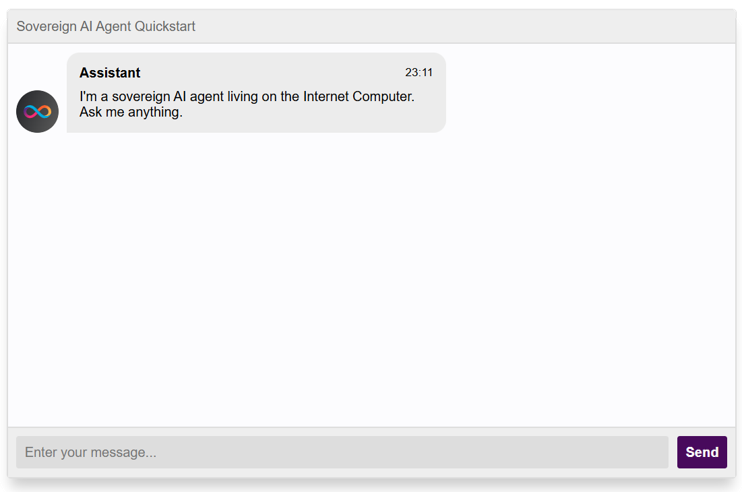

<!-- ---
description: Conoce la propuesta de valor en IA de ICP.
icon: brain
--- -->

# 🧠 Viernes: Autenticación y módulos 🔐

<figure><figcaption></figcaption></figure>

## Internet Identity

Internet Identity (II) es un sistema de identidad descentralizado que te permite autenticarte de forma segura y anónima en las dApps de Internet Computer (ICP). Para los desarrolladores, II es crucial ya que simplifica la gestión de la identidad del usuario en sus aplicaciones. Al integrar II, puedes ofrecer a tus usuarios una experiencia de inicio de sesión fluida y segura, sin necesidad de almacenar contraseñas o datos personales. Además, II te permite probar y depurar tu código localmente, simulando la autenticación de usuarios reales. Al utilizar Internet Identity, puedes construir dApps más seguras y fáciles de usar, aprovechando al máximo el potencial de Internet Computer.

<!-- 
Repositorio Oficial
 -->
🔗 📚  <a href="https://github.com/dfinity/internet-identity/tree/main/demos/using-dev-build" target="_blank">Repositorio Oficial</a>.
<!-- 
Documentación oficial sobre la integración de Internet Identity
 -->
🔗 🔐 <a href="https://internetcomputer.org/docs/building-apps/authentication/integrate-internet-identity" target="_blank">Documentación oficial sobre la integración de Internet Identity</a>.
<!-- 
Recuerda que puedes crear tu propia identidad [acá](https://identity.ic0.app/). Sin embargo, las identidades que usaremos en desarrollo son identidades ficticias.
 -->
> ℹ️ Recuerda que puedes crear tu propia identidad <a href="https://identity.ic0.app/" target="_blank">acá 🔗</a>. Sin embargo, las identidades que usaremos en desarrollo son identidades ficticias.
<!-- 
dApp de Ejemplo
 -->
🔗 📱 <a href="https://4rnkm-6yaaa-aaaag-ab6qq-cai.icp0.io/" target="_blank">dApp de Ejemplo</a>.
<br>

<figure><figcaption></figcaption></figure>

## Módulos Externos: Ampliando las Capacidades de tu Desarrollo en Motoko

Los módulos externos, también conocidos como librerías, son componentes de código reutilizables que extienden las funcionalidades de Motoko. Al igual que en otros lenguajes de programación, te permiten aprovechar el trabajo de otros desarrolladores, ahorrando tiempo y esfuerzo en la creación de tus dApps. Utilizar módulos externos te permite acceder a funcionalidades predefinidas, como estructuras de datos complejas, algoritmos optimizados o integraciones con servicios externos, lo que te permite construir aplicaciones más robustas y eficientes. Para gestionar estos módulos, Motoko cuenta con gestores de paquetes como Mops y Vessel, que facilitan la instalación y actualización de las librerías que necesitas para tu proyecto.

<!-- 
Mops
 -->
🔗 <a href="https://mops.one/" target="_blank">Mops</a>.
<!-- 
Vessel
 -->
🔗 <a href="https://github.com/dfinity/vessel" target="_blank">Vessel</a>.
<!-- 
Documentación oficial
 -->
🔗 📖 <a href="https://internetcomputer.org/docs/tutorials/developer-liftoff/level-3/3.1-package-managers" target="_blank">Documentación oficial</a>.

<figure><figcaption></figcaption></figure>

## Construye Agentes de IA Soberanos con Canisters en Internet Computer

Internet Computer te empodera para crear y desplegar servicios de software a prueba de manipulaciones, otorgándote verdadera propiedad y soberanía digital. Estos servicios, conocidos como canisters, ahora pueden integrarse con Modelos de Lenguaje Grandes (LLMs) con unas pocas líneas de código. Imagina construir agentes de Inteligencia Artificial que realmente posees y controlas, ejecutándose directamente en la blockchain de ICP. En este programa, aprenderás a aprovechar esta poderosa combinación para desarrollar aplicaciones innovadoras y descentralizadas que marcan la diferencia.

```rust
import LLM "mo:llm";

await LLM.prompt(#Llama3_1_8B, "Cuál es la velocidad de la luz?")
```

<!-- 
Documentación oficial
 -->
🔗 📖 <a href="https://internetcomputer.org/ai" target="_blank">Documentación oficial</a>.
<!-- 
Agentes de IA en ICP
 -->
🔗 🤖  <a href="https://internetcomputer.org/ai-agents" target="_blank">Agentes de IA en ICP</a>.

### Demostración

Puedes probar esta capacidad de ICP utilizando este pequeño Live Demo.

<figure><figcaption></figcaption></figure>

<!--  -->
🔗 📱 <a href="https://vgjrt-uyaaa-aaaal-qsiaq-cai.icp0.io" target="_blank">Live demo</a>.

🔗 🚀 Si deseas desplegarlo por ti mismo, puedes hacerlo desde <a href="https://icp.ninja/projects/llm-chatbot" target="_blank">acá</a>.
<!--  -->

<figure><figcaption></figcaption></figure>

