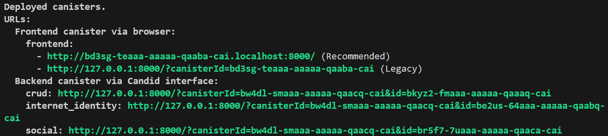

# 💻 Martes: Integración de un frontend al canister 🎨🖌️

<figure><figcaption></figcaption></figure>

El desarrollo frontend en el Internet Computer Protocol (ICP) se centra en la creación de interfaces de usuario  dinámicas para aplicaciones descentralizadas (dApps). Estas interfaces permiten a los usuarios interactuar directamente con canisters (contratos inteligentes) y servicios alojados en la red ICP, ofreciendo experiencias web completamente descentralizadas.

Para facilitar la implementación y el alojamiento de estas interfaces, ICP introduce el concepto de **asset canisters**.
## ¿Qué un Asset Canister?
Un asset canister, también conocido como ``frontend canister``, es un tipo especial de canister diseñado para almacenar y servir activos web estáticos, como archivos HTML, CSS, JavaScript, imágenes y otros recursos necesarios para el frontend de una aplicación. Estos canisters compilan los activos frontend en un módulo WebAssembly (Wasm) que puede ser desplegado y ejecutado en la red ICP. 

La configuración de un asset canister se realiza mediante el archivo ``dfx.json`` del proyecto, donde se define el canister con el tipo "assets". Esto indica a dfx que compile los activos frontend utilizando código base en Rust, que luego se convierte en Wasm para su despliegue.

[🔗📖 Documentación oficial sobre Asset Canisters](https://internetcomputer.org/docs/building-apps/frontends/using-an-asset-canister)

## Lenguajes Compatibles para el Desarrollo de Frontend en ICP

El desarrollo de interfaces para aplicaciones en Internet Computer Protocol (ICP) es altamente flexible, permitiendo a los desarrolladores utilizar una variedad de frameworks modernos y ampliamente adoptados en la industria del desarrollo web. Actualmente el protocolo es compatible con frameworks basados en Node.js. Ejemplo de los mas usados son:

### Vanilla JavaScrip
 
<br>
<br>

Vanilla JS es la forma más pura de escribir JavaScript, sin el uso de librerías ni frameworks. Es ideal para proyectos livianos, pruebas rápidas o cuando se desea un control total sobre el comportamiento del frontend.
 En ICP, Vanilla JS puede integrarse directamente con un asset canister y comunicarse con canisters backend mediante la librería ``@dfinity/agent``. Su simplicidad también lo hace ideal para comprender cómo funciona la interacción entre el frontend y la infraestructura descentralizada.

[🔗📖 Más información sobre Vanilla.js 🔎](http://vanilla-js.com/)

---
 ### React


<br>
<br>

React es una biblioteca declarativa y basada en componentes para construir interfaces de usuario. Su popularidad, ecosistema y flexibilidad lo convierten en una de las mejores opciones para desarrollar frontends sobre ICP.

Utilizando herramientas como Vite o Webpack junto con ``@dfinity/agent`` y ``@dfinity/auth-client``, React permite crear experiencias ricas que se comunican con canisters de forma fluida. Además, al compilar el proyecto para producción (``npm run build``), los archivos generados pueden ser fácilmente desplegados en un asset canister.

[🔗📖 Más información sobre React 🔎](https://es.react.dev/)

---
### Netx.js


<br>
<br>

Next.js es un framework de React que facilita funcionalidades avanzadas como enrutamiento, renderizado del lado del servidor (SSR) y generación estática. Aunque ICP no soporta SSR directamente dentro de los canisters debido a limitaciones en la ejecución de JavaScript en el backend, Next.js sigue siendo compatible si se utiliza con exportación estática (``next export``), convirtiendo el sitio en archivos HTML, JS y CSS estáticos listos para desplegar.

Esta estrategia permite aprovechar muchas de las ventajas de Next.js (como su estructura organizada, manejo de rutas, y optimización automática) mientras se mantiene la compatibilidad con los asset canisters del ICP.

[🔗📖 Más información sobre Next.js 🔎](https://nextjs.org/)


### Otros Frameworks

Además de los anteriormente mencionados, también se pueden usar otros frameworks como Vue.js, Svelte o incluso Lit para desarrollar dApps en ICP. Siempre que el resultado del proceso de construcción (``build``) genere archivos estáticos, estos pueden ser servidos por un asset canister.


## Integración de Frontend con ICP: Uso de AuthClient y Agent
En el desarrollo de dApps sobre el Internet Computer Protocol (ICP), uno de los aspectos clave es la interacción segura entre el frontend y los canisters que componen el backend de la aplicación. Para ello, el ecosistema de DFINITY proporciona dos herramientas esenciales: ``AuthClient`` y ``Agent``.

### AuthClient: Autenticación con Internet Identity

@dfinity/auth-client es una biblioteca que permite integrar autenticación de usuarios en aplicaciones ICP mediante Internet Identity, el sistema de identidad descentralizado nativo del protocolo.

Con AuthClient, los usuarios pueden iniciar sesión de forma segura en una dApp utilizando anclas de identidad que no requieren nombres de usuario ni contraseñas tradicionales. En su lugar, utilizan mecanismos criptográficos como WebAuthn, que pueden estar respaldados por biometría o llaves físicas.

**Características principales:**

* Permite iniciar y cerrar sesión en la dApp.

* Administra tokens de delegación, que otorgan acceso temporal a un usuario autenticado.

* Se integra fácilmente con el HttpAgent para firmar peticiones a canisters en nombre del usuario.

**Ejemplo de implementación:**
```rust
import { AuthClient } from '@dfinity/auth-client';

const environment = process.env.DFX_NETWORK === 'local'

const authClient = await AuthClient.create()
await authClient.login({
      maxTimeToLive: BigInt(7 * 24 * 60 * 60 * 1000 * 1000 * 1000), 
      identityProvider: environment? 
      `http://${process.env.CANISTER_ID_INTERNET_IDENTITY}.localhost:4943/` : 
      "https://identity.ic0.app", 
      onSuccess: async () => {
        window.location.reload()
        }
    })
```
### Agent: Comunicación con Canisters

Un ``agente`` es una API usada para interactuar con la API publica de ICP y lo canisters desplegados dentro de la blockchain. Estos agentes cuentan con un soporte de autenticacion atraves de la libreria ``auth-client``, que es la que usa el servicio de Internet Identity. Existen dos maneras para gestionar la duración de la sesión, la primera de ellas es establecer un tiempo de vida a la autenticación mediante el ``maxTimeToLive`` y la segunda es el ``idle Manager``, que se encarga de monitorear la ausencia de interacciones con la pagina o aplicacion mediante la actividad de los perifericos automaticamente la sesion se cierra tras 10 min de inactividad, sin embargo este valor puede cambar para una mayor personalizacion

``@dfinity/agent`` es una biblioteca que permite a aplicaciones frontend interactuar con canisters desplegados en la red ICP. Este paquete expone la clase ``HttpAgent``, que puede enviar mensajes (``update`` o ``query``) firmados a los canisters.

Junto con IDL (el lenguaje de descripción de interfaces de ICP), ``Agent`` permite construir interfaces de comunicación entre el frontend y los métodos públicos de un canister.

**Funciones clave del Agent:**

* Se conecta con canisters usando sus IDs.

* Firma solicitudes con la identidad del usuario (cuando se combina con AuthClient).

* Soporta peticiones tanto en modo de lectura (query) como de escritura (update).

* Puede configurarse para apuntar a redes locales (réplica) o a la mainnet de ICP.

**Ejemplo de implementación:**
```rust
import { createActor, canisterId } from "dirección de la carpeta 'declarations'"

import { HttpAgent } from '@dfinity/agent' 

const localHost = "http://localhost:4943"
const productionHost = "https://ic0.app"

const identity = authClient.getIdentity()
  const agent = new HttpAgent ({
    identity, 
    host: environment? localHost : productionHost,
  })
  const actor = createActor(canisterId, {
    agent
  })
```

[🔗📖 Documentación oficial sobre Internet Identity y como integrarlo en un proyecto](https://internetcomputer.org/docs/tutorials/hackathon-prep-course/authentication)

## Despliegue de dApps
Uno de los pasos más importantes en el desarrollo de una aplicación descentralizada (dApp) en Internet Computer Protocol (ICP) es el despliegue de canisters, los "contratos inteligentes" nativos de esta red. Los canisters contienen la lógica de negocio, el almacenamiento de datos, y también pueden servir activos del frontend. En ICP, desplegar tu canister significa lanzar tu aplicación a una red escalable, segura y completamente descentralizada.

**El proceso puede realizarse en dos entornos:**

###  1. Despliegue Local (Entorno de Desarrollo) 🚧
Antes de publicar tu canister en la red principal, puedes probarlo localmente utilizando la herramienta ``dfx`` (el CLI oficial de DFINITY). Esto simula una instancia local del Internet Computer para desarrollo y pruebas.

Para esto debes posicionar tu terminal en la carpeta raiz del proyecto. Estando ahí, ejecuta los siguientes comandos:

* ``dfx start --clean --background``:  Este comando inicia una réplica local del Internet Computer en tu computadora para simular el comportamiento de la red ICP.

* ``dfx deploy``: Este comando compila e instala (o actualiza) los canisters en el entorno que estás usando (puede ser local o en la red principal).

Al finalizar el ``deploy`` aparecerán los siguientes mensajes en la consola, donde se proporcionaran los enlaces para acceder al ``frontend`` de la aplicación como al ``backend`` mediante ``candid UI``.


<br>

> ⚠️ En el caso de acceder al frotnend, usar de preferencia los enlaces recomendados.

### 2. Despliegue en Mainnet (Red Principal de ICP) 🌐 

Una vez que tu canister está listo para producción, puedes desplegarlo a la red principal de ICP, accesible a través de dominios como icp0.io. Para hacerlo, necesitas una wallet ICP con cycles (el “combustible” que permite ejecutar operaciones en los canisters).

## Costos por Transacción y Almacenamiento

## Explorando Transacciones