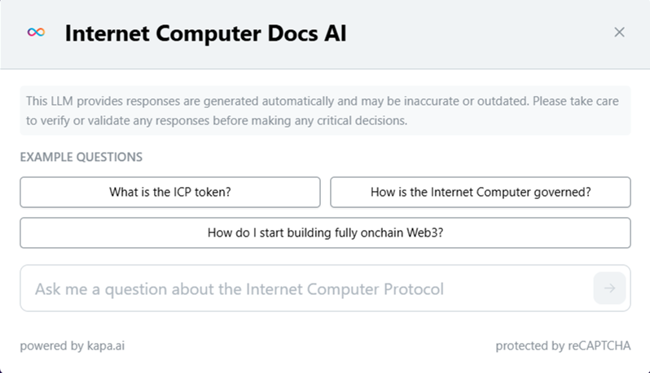

# Martes: Entornos de desarrollo y variables

<figure><figcaption></figcaption></figure>

¡Listo para construir dApps en Internet Computer? Antes de comenzar, necesitamos configurar tu entorno de desarrollo. Te ofrecemos tres opciones flexibles para adaptarnos a tus preferencias y experiencia:

1. **Docker:** Si buscas un entorno aislado y consistente, Docker es tu aliado. Esta opción te permite tener todas las herramientas necesarias en contenedores, evitando conflictos y facilitando la instalación.
2. **Gitpod:** ¿Prefieres un entorno de desarrollo en la nube? Gitpod te ofrece un espacio de trabajo preconfigurado en tu navegador, listo para codificar con un solo clic.
3. **Instalación Local:** Para aquellos que prefieren tener el control total, esta opción te guía a través de la instalación manual de todas las herramientas necesarias en tu sistema operativo.

Elige la opción que mejor se adapte a tus necesidades y ¡prepárate para dar vida a tus ideas en Internet Computer!


Cualquiera de las opciones es válida para realizar tu certificación. Recuerda que al final tendrás que entregar un repositorio público alojado en [GitHub](https://github.com/).


Dependiendo de la opción que hayas elegido, lo que necesitas instalar cambia. Acá te dejamos el resumen:

<table><thead><tr><th width="158">Ambiente</th><th>Instalación</th></tr></thead><tbody><tr><td>Docker</td><td>Docker, VS Code</td></tr><tr><td>Gitpod</td><td>Navegador de internet</td></tr><tr><td>Local</td><td>WSL (sólo en Windows), VS Code con sus extensiones y dfxvm.</td></tr></tbody></table>


Documentación oficial sobre la instalación del ambiente de desarrollo (en inglés)


<figure><figcaption></figcaption></figure>

## Motoko Playground

El Motoko Playground es un IDE en línea diseñado para facilitar el aprendizaje de Motoko, el lenguaje nativo de Internet Computer. Con esta herramienta, puedes desplegar canisters directamente en tu navegador, sin necesidad de descargar un SDK. Es una excelente opción para familiarizarte con la sintaxis y los conceptos básicos de Motoko.

Sin embargo, es importante tener en cuenta que el Motoko Playground está destinado principalmente a la **práctica** y la **experimentación**. Para el desarrollo completo de **dApps** y la creación de proyectos que puedas subir a GitHub, te recomendamos encarecidamente que elijas una de las opciones de instalación local **(Docker, Gitpod o instalación local directa)** que hemos descrito anteriormente. Estas opciones te proporcionarán un entorno de desarrollo completo y te permitirán trabajar de manera eficiente en tus proyectos de Internet Computer.


dApp Motoko Playground


<figure><figcaption></figcaption></figure>

## Docker

<figure><figcaption></figcaption></figure>


Sólo es necesario instalar Docker si elegiste la primer opción de ambiente de desarrollo: **Docker**.


Docker te ofrece la posibilidad de crear un entorno de desarrollo completamente aislado y consistente, donde todas las herramientas y dependencias necesarias para desarrollar en Internet Computer se encuentran encapsuladas en contenedores. Esto significa que puedes evitar los problemas de compatibilidad y configuración que a menudo surgen al instalar herramientas directamente en tu sistema operativo. Además, Docker te permite replicar fácilmente tu entorno de desarrollo en diferentes máquinas, lo que facilita la colaboración y garantiza que todos los miembros del equipo trabajen con la misma configuración.


Documentación oficial Docker



Recomendamos instalar [Docker Desktop](https://docs.docker.com/desktop/). Ten en cuenta que la instalación es diferente para cada sistema operativo.



Instalación Docker Desktop para Mac



Instalación Docker Desktop para Windows



Instalación Docker Desktop para Linux


<figure><figcaption></figcaption></figure>

## VsCode

<figure><figcaption></figcaption></figure>


Sólo es necesario instalar VS Code si elegiste la primera o la tercera opción de ambiente de desarrollo: **Docker** ó **Local**.


Para una experiencia de desarrollo óptima en Motoko, te recomendamos instalar Visual Studio Code (**VS Code**). Este editor de código, ampliamente utilizado por desarrolladores de todo el mundo, ofrece una gran cantidad de extensiones útiles que facilitan la programación en Motoko. Además, contar con un IDE (Entorno de Desarrollo Integrado) como VS Code es esencial para escribir, depurar y organizar tu código de manera eficiente. VS Code te proporcionará las herramientas necesarias para construir dApps en Internet Computer de forma profesional y productiva.


Descargar VS Code


Si elegiste **Docker** para tu ambiente de desarrollo, las extensiones necesarias serán instaladas al seguir las indicaciones de tu instructor. De otra manera, es necesario instalarlas manualmente.


Extensión VS Code Motoko



Tambien puedes instalar extensiones en GitPod.


<figure><figcaption></figcaption></figure>

## Instalación Local

### WSL

Si estás utilizando Windows y deseas desarrollar dApps en Internet Computer, es esencial instalar el Subsistema de Windows para Linux (WSL). DFX, la herramienta de línea de comandos que te permite interactuar con la blockchain de ICP, está diseñada para funcionar en entornos Linux o macOS. WSL te proporciona un entorno Linux dentro de Windows, lo que te permite ejecutar DFX y otras herramientas necesarias sin necesidad de cambiar de sistema operativo. Instalar WSL te abre las puertas al desarrollo de dApps en ICP, permitiéndote aprovechar todas las funcionalidades de DFX en tu entorno Windows.


Documentación oficial


De igual manera, para que VS Code pueda interactuar con tu instancia de Linux en Windows, es necesario instalar la siguiente extensión:


Extensión VS Code WSL


<figure><figcaption></figcaption></figure>

### DFX: El SDK del Internet Computer Protocol

DFX es tu herramienta esencial para crear y gestionar dApps en ICP. Este kit de desarrollo incluye: `dfx`, una interfaz de línea de comandos para administrar proyectos, identidades y ciclos; `dfxvm`, un gestor de versiones para DFX; `moc`, el compilador de Motoko; y `replica`, una instancia local de la red para pruebas y desarrollo. Instalar DFX te permite interactuar con la blockchain de ICP, compilar tus canisters y probar tus aplicaciones localmente, proporcionándote todo lo necesario para construir en Internet Computer.


Recuerda que si estás usando Windows, la instalación de DFX debe ser hecha en WSL.



Documentación oficial sobre la instalación de DFX



Introducción a DFX


# Introducción a Motoko
<figure><figcaption></figcaption></figure>

## ¿Que es Motoko?
**Motoko** es un lenguaje de programación diseñado específicamente por DFINITY para el desarrollo de canisters en Internet Computer (ICP). Su arquitectura está optimizada para aprovechar las características únicas y los flujos de trabajo de ICP, ofreciendo un entorno de programación robusto y familiar. Con una sintaxis similar a lenguajes como JavaScript, Ruby, Python o Solidity, Motoko es fácil de aprender y usar para el desarrollo de aplicaciones.

## Motoko Playground

El Motoko Playground es un IDE en línea diseñado para facilitar el aprendizaje de Motoko, el lenguaje nativo de Internet Computer. Con esta herramienta, puedes desplegar canisters directamente en tu navegador, sin necesidad de descargar un SDK. Es una excelente opción para familiarizarte con la sintaxis y los conceptos básicos de Motoko.

Sin embargo, es importante tener en cuenta que el Motoko Playground está destinado principalmente a la **práctica** y la **experimentación**. Para el desarrollo completo de **dApps** y la creación de proyectos que puedas subir a GitHub, te recomendamos encarecidamente que elijas una de las opciones de instalación local **(Docker, Gitpod o instalación local directa)** que hemos descrito anteriormente. Estas opciones te proporcionarán un entorno de desarrollo completo y te permitirán trabajar de manera eficiente en tus proyectos de Internet Computer.

<!-- 
dApp Motoko Playground
 -->
[🔗📱 dApp Motoko Playground](https://m7sm4-2iaaa-aaaab-qabra-cai.raw.ic0.app/)
<figure><figcaption></figcaption></figure>

```rust
// Un canister simple utilizando Motoko.

actor Main {
  public query func hello() : async Text {
    "Hola ICP Devs! :D"
  };
};

await Main.hello();
```

**Atributos de Motoko:**

* **Soporte completo para Candid:** Motoko tiene soporte completamente automático para Candid, integrado en el tiempo de ejecución y el sistema compilador de Motoko.
* **Soporte para memoria estable:** Motoko soporta automáticamente la memoria estable.
* **Soporte para flujo de datos y control asíncronos:** Soporte nativo.
* **Soporte para el paradigma de actores:** Soporte nativo.
* **Análisis estático específico de ICP:** Aplicado a través de múltiples comprobaciones de seguridad.
* **Tamaño binario Wasm:** El tamaño binario Wasm es muy pequeño.
* **Tiempo de compilación:** Motoko tiene un tiempo de compilación más rápido que Rust.
* **Dificultad de aprendizaje:** Aprender Motoko es bastante fácil.
* **Gestión de memoria:** La memoria se gestiona mediante un proceso automático de recolección de basura.
* **Soporte para interfaz de funciones externas:** Aún no soportado.

<!-- 
Documentación oficial lenguajes ICP
 -->
[🔗📖 Documentación oficial de los lenguajes compatibles con ICP](https://internetcomputer.org/docs/tutorials/developer-liftoff/level-0/intro-languages/)
<!-- 
Introducción de Motoko
 -->
[🔗🛠️ Introducción a Motoko](https://internetcomputer.org/docs/motoko/main/getting-started/motoko-introduction)

<figure><figcaption></figcaption></figure>

## Motoko: Un Inicio Rápido en el Entorno Local

Esta sección te guiará a través de los pasos esenciales para crear tu primer proyecto en Motoko, desde la configuración inicial hasta el despliegue de tu primer canister. Aprenderás a utilizar las herramientas clave, como DFX, y a escribir código Motoko básico para interactuar con la blockchain de Internet Computer. Este tutorial rápido te proporcionará una base sólida para comenzar a construir tus propias dApps y explorar el potencial de Motoko en el ecosistema de ICP.

### Crear un nuevo proyecto

Abre una ventana de la terminal en tu computadora. Crea un directorio nuevo en donde almacenaremos los archivos de nuestro proyecto y navega a este directorio:

```
mkdir hello_world
cd hello_world
```

Ahora, utilizaremos `dfx` para crear nuestro proyecto:

```
dfx new hello_world
```

Obtendrás una pantalla similar a la siguiente, esta es la configuración inicial de nuestro proyecto:

<pre class="language-bash"><code class="lang-bash"><strong>? Select a backend language: ›
</strong>❯ Motoko
Rust
TypeScript (Azle)
Python (Kybra) code
</code></pre>

Selecciona Motoko, posteriormente seleccionamos la opción `No frontend canister` dado a que estaremos trabajando exclusivamente con un smart contract backend:

```bash
? Select a frontend framework: ›
SvelteKit
React
Vue
Vanilla JS
No JS template
❯ No frontend canister
```

Tambien puedes incluir algunas características extras en tu proyecto, por lo pronto sólo presiona `Enter` para confirmar la creación del proyecto:

```bash
? Add extra features (space to select, enter to confirm) ›
⬚ Internet Identity
⬚ Bitcoin (Regtest)
⬚ Frontend tests
```

### Código del smart contract

Este actor `hello_world` tiene una sola función llamada `saludar`. Está marcada como `query` porque no modifica el estado del actor. La función acepta un nombre como entrada de tipo `Text` y devuelve un saludo de tipo `Text`.

```rust
actor {
  public query func saludar(nombre: Text) : async Text {
    return "Hola, " # nombre # "!";
  };
};
```

### Inicializando el ambiente de desarrollo

Ahora vamos a utilizar `dfx`para inicializar el ambiente de desarrollo donde estaremos desplegando nuestro smart contract:

```
dfx start --background --clean
```

Para desplegar, utilizaremos el comando:

```
dfx deploy
```

Obtendrás algo como lo siguiente en pantalla:

```
...
Committing batch.
Committing batch with 18 operations.
Deployed canisters.
URLs:
Backend canister via Candid interface:
        access_hello_world_backend: http://127.0.0.1:4943/?canisterId=cbopz-duaaa-aaaaa-qaaka-cai&id=ctiya-peaaa-aaaaa-qaaja-cai
```

Para finalizar, interactúa con tu contrato recien desplegado haciendo click en el link que se generó en tu terminal.

<!-- 
Quickstart oficial en inglés
 -->
[🔗⚡ Quickstart oficial en inglés](https://internetcomputer.org/docs/motoko/main/getting-started/quickstart)

<figure><figcaption></figcaption></figure>

## Explorando la Documentación de Motoko: Tu Guía de Referencia

A medida que avances en tu desarrollo con Motoko, la documentación oficial se convertirá en tu recurso indispensable. Encontrarás información detallada sobre la sintaxis del lenguaje, las funciones disponibles y los conceptos avanzados que necesitarás para construir tus canisters. Aunque la documentación está en inglés, no te preocupes, durante las sesiones de aprendizaje cubriremos los aspectos esenciales para completar tu proyecto final y obtener tu certificación. Te animamos a explorar la documentación para profundizar en tus conocimientos y convertirte en un desarrollador de Motoko experto.

<!-- 
Documentación base Motoko
 -->
[🔗📖 Documentación base Motoko](https://internetcomputer.org/docs/motoko/main/base/)
<!-- 
Referencia del lenguaje Motoko
 -->
[🔗📖 Referencia del lenguaje Motoko](https://internetcomputer.org/docs/motoko/main/reference/language-manual)
### Apoyo con IA

La página oficial del Internet Computer Protocol ofrece una pequeña IA para ayudarte con tus consultas. Puedes acceder a ella utilizando el <mark style="color:red;">siguiente botón</mark> en la parte superior derecha:

<figure><figcaption></figcaption></figure>

Lo cual traerá la siguiente ventana al frente:

<figure><figcaption></figcaption></figure>

Esta IA acepta preguntas en español, así que no dudes en utilizarla.

### AI Chatbot

También ponemos a tu disposición este pequeño chatbot que te podrá ayudar con **dudas básicas** sobre el desarrollo en Motoko.

<!-- 
AI Chatbot ICP
 -->
[🔗🤖 AI Chatbot ICP](https://icp-ai-chat-frontend.vercel.app/)
<!-- 
Este chatbot se encuentra en desarrollo, por lo que la información o código que te proporcione pueden no ser siempre correctos.
 -->
> ⚠️ Este chatbot se encuentra en desarrollo, por lo que la información o código que te proporcione pueden no ser siempre correctos.
<figure><figcaption></figcaption></figure>

## Tipos de datos primitivos en Motoko

En Motoko, los tipos de datos primitivos son los bloques de construcción fundamentales para representar valores simples y comunes. Estos tipos incluyen booleanos (verdadero/falso), enteros con y sin signo de diferentes tamaños, caracteres y texto. La elección del tipo de dato primitivo adecuado es crucial, ya que determina qué operaciones (aritméticas, lógicas, relacionales) pueden aplicarse a los valores que representan. La categoría de un tipo, por lo tanto, define el conjunto de operadores disponibles, permitiendo a los desarrolladores realizar cálculos y manipulaciones de datos de manera precisa y eficiente.

<table><thead><tr><th width="182">Identificador</th><th>Descripción</th></tr></thead><tbody><tr><td><a href="https://internetcomputer.org/docs/motoko/main/base/Bool">Bool</a></td><td>Valores booleanos <code>true</code> y <code>false</code>, y operadores lógicos.</td></tr><tr><td><a href="https://internetcomputer.org/docs/motoko/main/base/Char">Char</a></td><td>Caracteres Unicode.</td></tr><tr><td><a href="https://internetcomputer.org/docs/motoko/main/base/Text">Text</a></td><td>Cadenas de caracteres Unicode con concatenación <code>_ # _</code> e iteración.</td></tr><tr><td><a href="https://internetcomputer.org/docs/motoko/main/base/Float">Float</a></td><td>Valores de punto flotante de 64 bits.</td></tr><tr><td><a href="https://internetcomputer.org/docs/motoko/main/base/Int">Int</a></td><td>Valores enteros con signo con aritmética (sin límites).</td></tr><tr><td><a href="https://internetcomputer.org/docs/motoko/main/base/Int8">Int8</a></td><td>Valores enteros con signo de 8 bits con aritmética comprobada.</td></tr><tr><td><a href="https://internetcomputer.org/docs/motoko/main/base/Int16">Int16</a></td><td>Valores enteros con signo de 16 bits con aritmética comprobada.</td></tr><tr><td><a href="https://internetcomputer.org/docs/motoko/main/base/Int32">Int32</a></td><td>Valores enteros con signo de 32 bits con aritmética comprobada.</td></tr><tr><td><a href="https://internetcomputer.org/docs/motoko/main/base/Int64">Int64</a></td><td>Valores enteros con signo de 64 bits con aritmética comprobada.</td></tr><tr><td><a href="https://internetcomputer.org/docs/motoko/main/base/Nat">Nat</a></td><td>Valores enteros no negativos con aritmética (sin límites).</td></tr><tr><td><a href="https://internetcomputer.org/docs/motoko/main/base/Nat8">Nat8</a></td><td>Valores enteros no negativos de 8 bits con aritmética comprobada.</td></tr><tr><td><a href="https://internetcomputer.org/docs/motoko/main/base/Nat16">Nat16</a></td><td>Valores enteros no negativos de 16 bits con aritmética comprobada.</td></tr><tr><td><a href="https://internetcomputer.org/docs/motoko/main/base/Nat32">Nat32</a></td><td>Valores enteros no negativos de 32 bits con aritmética comprobada.</td></tr><tr><td><a href="https://internetcomputer.org/docs/motoko/main/base/Nat64">Nat64</a></td><td>Valores enteros no negativos de 64 bits con aritmética comprobada.</td></tr><tr><td><a href="https://internetcomputer.org/docs/motoko/main/base/Blob">Blob</a></td><td>Blobs binarios con iteradores.</td></tr><tr><td><a href="https://internetcomputer.org/docs/motoko/main/base/Principal">Principal</a></td><td>Principales.</td></tr><tr><td><a href="https://internetcomputer.org/docs/motoko/main/base/Error">Error</a></td><td>Valores de error.</td></tr><tr><td><a href="https://internetcomputer.org/docs/motoko/main/base/Region">Region</a></td><td>Objetos de región de memoria estable.</td></tr></tbody></table>


🔗📖 Documentación Oficial

<!-- [🔗📖 Documentación Oficial](https://internetcomputer.org/docs/motoko/main/reference/language-manual#primitive-types) -->

<figure><figcaption></figcaption></figure>

